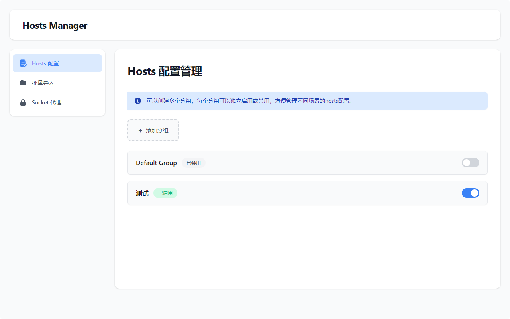

# Hosts Manager Extension

<p align="center">
  
</p>

<h3 align="center">一个用于管理 hosts 映射的浏览器扩展，支持分组功能</h3>

<p align="center">
  <a href="https://github.com/ccpopy/hosts-manager-extension/releases"></a>
  <a href="https://github.com/ccpopy/hosts-manager-extension/stargazers"></a>
  <a href="https://github.com/ccpopy/hosts-manager-extension/issues"></a>
  <a href="https://github.com/ccpopy/hosts-manager-extension/blob/main/LICENSE"></a>
  <a href="https://chromewebstore.google.com/detail/hosts-manager/ekofkbkmenfagdkijaplfbdcdnlddjod" target="_blank"></a>
  <a href="https://chromewebstore.google.com/detail/hosts-manager/ekofkbkmenfagdkijaplfbdcdnlddjod" target="_blank"></a>
  <a href="https://microsoftedge.microsoft.com/addons/Microsoft-Edge-Extensions-Home?hl=zh-CN"></a>
</p>

## 🎯 功能特点

- 📁 **分组管理** - 按项目或用途组织你的 hosts 规则
- 🔄 **快速切换** - 一键启用/禁用分组，无需重复编辑
- 📝 **批量导入** - 支持从文件或剪贴板批量导入规则
- 🌐 **Socket 代理** - 内置 Socket 代理配置支持
- 💾 **本地存储** - 所有数据本地保存，安全可靠
- 🎨 **现代界面** - 清爽简洁的 Material Design 风格

## 📸 界面截图



<p align="center">主界面 - 分组管理</p>

## 🚀 安装方法

### 方法一：从 Release 安装（推荐）

1. 前往 [Releases](../../releases) 页面
2. 下载最新版本的 `hosts-manager.zip` 文件
3. 解压到本地文件夹
4. 打开 Chrome 浏览器，访问 `chrome://extensions/`
5. 开启右上角的"开发者模式"
6. 点击"加载已解压的扩展程序"
7. 选择解压后的文件夹

### 方法二：使用 CRX 文件

1. 下载 `hosts-manager.crx` 文件
2. 打开 Chrome 扩展管理页面
3. 将 CRX 文件拖放到页面中
4. 确认安装

### 方法三：从源码安装

```bash
# 克隆项目
git clone https://github.com/ccpopy/hosts-manager-extension.git
cd hosts-manager-extension

# 在 Chrome 中加载
# 1. 打开 chrome://extensions/
# 2. 开启"开发者模式"
# 3. 点击"加载已解压的扩展程序"
# 4. 选择 host 目录
```

## 📖 使用说明

### 基本操作

1. **创建分组**：点击"新建分组"按钮，输入分组名称
2. **添加规则**：在分组中添加 hosts 映射规则
3. **启用/禁用**：使用开关控制分组的启用状态
4. **编辑删除**：右键菜单提供编辑和删除功能

### 批量导入

支持标准的 hosts 文件格式：

```
# 开发环境
192.168.1.100 dev.example.com
192.168.1.101 api.example.com

# 测试环境
10.0.0.50 test.example.com
10.0.0.51 api-test.example.com
```

### Socket 代理配置

1. 点击工具栏的设置图标
2. 选择"Socket 代理"
3. 配置代理服务器地址和端口
4. 选择需要代理的协议

## 🛠️ 技术栈

- **框架**：原生 JavaScript + Chrome Extensions API
- **构建**：GitHub Actions 自动化构建
- **版本**：Manifest V3

## 📁 项目结构

```
hosts-manager-extension/
├── README.md                 # 项目说明
├── LICENSE                   # MIT 许可证
├── .github/
│   └── workflows/           # GitHub Actions 配置
├── screenshots/             # 界面截图
└── host/                    # 扩展主目录
    ├── manifest.json        # 扩展清单
    ├── background.js        # 后台脚本
    ├── popup.html          # 弹出窗口
    ├── page.html           # 主页面
    ├── css/
    │   └── page.css        # 样式文件
    ├── js/
    │   ├── page.js         # 主逻辑
    │   └── popup.js        # 弹出窗口逻辑
    └── images/             # 图标资源
```

## 👨‍💻 开发指南

### 本地开发

```bash
# 克隆项目
git clone https://github.com/ccpopy/hosts-manager-extension.git
cd hosts-manager-extension

# 修改代码后，在扩展管理页面点击"重新加载"按钮
```

### 构建发布

项目使用 GitHub Actions 自动构建：

```bash
# 创建新版本
git tag v1.0.0
git push origin v1.0.0

# GitHub Actions 会自动：
# 1. 打包 ZIP 文件
# 2. 生成 CRX 文件
# 3. 创建 Release
# 4. 上传构建产物
```

## ⚠️ 注意事项

- 需要 Chrome 88+ 版本（支持 Manifest V3）
- 扩展需要代理权限来修改系统 hosts
- 可能与其他代理类扩展冲突
- 建议定期备份配置数据

## 🤝 贡献指南

欢迎贡献代码、报告问题或提出建议！

1. Fork 本仓库
2. 创建你的功能分支 (`git checkout -b feature/AmazingFeature`)
3. 提交你的更改 (`git commit -m 'Add some AmazingFeature'`)
4. 推送到分支 (`git push origin feature/AmazingFeature`)
5. 开启一个 Pull Request

## 📜 许可证

本项目基于 MIT 许可证开源 - 查看 [LICENSE](LICENSE) 文件了解详情

## 🌟 Star History

[](https://www.star-history.com/#ccpopy/hosts-manager-extension&Date)

## 📮 联系作者

- GitHub: [@ccpopy](https://github.com/ccpopy)
- Issues: [提交问题](https://github.com/ccpopy/hosts-manager-extension/issues)

---

<p align="center">
  <strong>如果觉得这个项目对你有帮助，请给个 ⭐ Star 支持一下！</strong>
</p>
